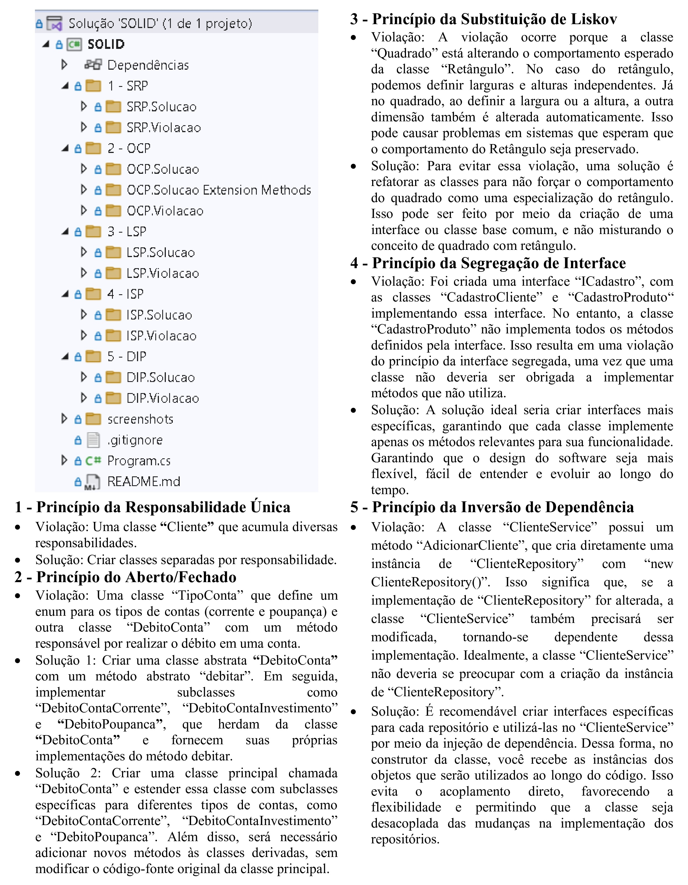

# SOLID

## 📝️ Escopo do Projeto

O projeto demonstra da aplicabilidade dos princípios do SOLID por meio de exemplos que ilustram tanto a violação quanto a solução de cada um deles: SRP (Princípio da Responsabilidade Única), OCP (Princípio do Aberto-Fechado), LSP (Princípio da Substituição de Liskov), ISP (Princípio da Segregação de Interfaces) e DIP (Princípio da Inversão de Dependências). 

## 🛠️ Construído com

* [Visual Studio 2022](https://learn.microsoft.com/pt-br/visualstudio/windows/?view=vs-2022) - Ferramenta de desenvolvimento, que permite realizar todo o ciclo de desenvolvimento em um só lugar.
  
## 📚 Principais Bibliotecas, Frameworks e Comandos do NuGet Utilizados

* [net6.0](https://learn.microsoft.com/pt-br/dotnet/core/whats-new/dotnet-6) - Versão da plataforma de desenvolvimento .NET, que é de código aberto e multiplataforma, desenvolvida pela Microsoft.

```
dotnet add package Microsoft.NET.Sdk.Web --version 6.0.0
```

* [System.Data.SqlClient](https://learn.microsoft.com/pt-br/dotnet/api/system.data.sqlclient?view=windowsdesktop-9.0) - Provedor de dados do .NET para SQL Server com objetovo de acessar um banco de dados do SQL Server.

```
NuGet\Install-Package System.Data.SqlClient -Version 4.9.0
```

## 🚧 Descrição da Estrutura do Projeto

A estrutura do projeto segundo a imagem abaixo é composta da seguinte forma:




## ⚠️ Atenção

Destinado exclusivamente para fins de estudo.

---
⌨️ por [Byron Doria](https://gist.github.com/lohhans) 😊
